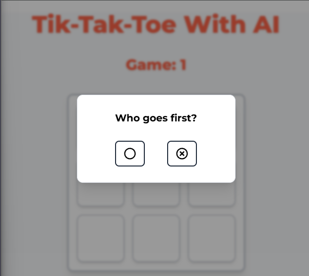

# 🎮 TIK-TAK-TOE with AI

A classic **Tic-Tac-Toe** game built using **React**, **JavaScript**, and **Tailwind CSS**.

Developed by [clevercoderjoy](https://github.com/clevercoderjoy) using **Vite** for fast performance.

---

## ✨ Features

- 🎯 Play against AI
- ⚡ Lightning-fast UI with Vite
- 💅 Clean and responsive styling with Tailwind CSS
- 🧠 AI logic with smart move decisions
- 🔁 Play Again / Reset functionality
- 🟰 MiniMax algorithm for unbeatable ai gameplay
- 🎉 Win / Draw detection with highlights
- ⚛️ Used React Portal for better modal rendering and DOM isolation
- 🪝 Custom hook for local storage; lazy-initialization, updates automatically on data changes.

---

## 🚀 Tech Stack

- **React**
- **JavaScript**
- **Tailwind CSS**
- **Vite**

---

## 📸 Preview

> 

---
